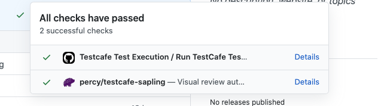
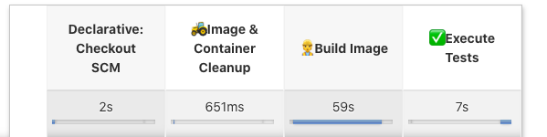
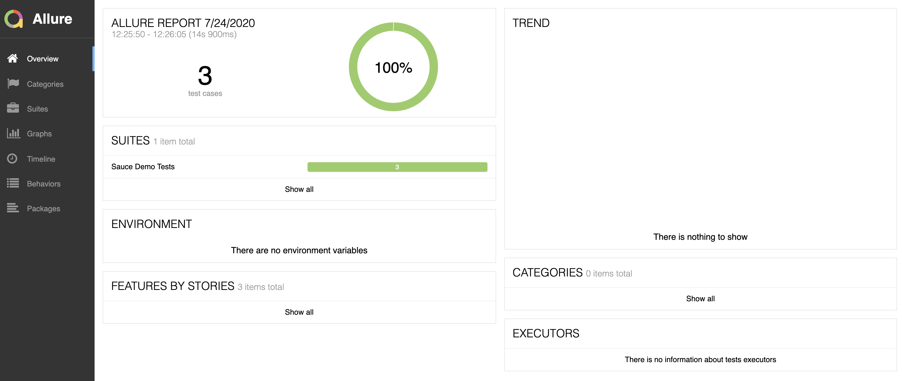

# 🌱 testcafe-sapling 🌱

_"plant the sampling to grow your tree, why look for seed?"_

## What is Included?

#### CI

Ready to go pipeline files available for :

- Jenkins
- Github Actions

#### Docker

- Docker commands to execute tests anywhere

#### Browserstack

- Scripts to execute tests on browserstack in simple steps

#### Reporting

- Built in support for Allure reporting

#### Cross Browser Testing

- Readily available commands to run tests in chrome, firefox or safari
- Execute tests concurrently in multiple browsers instances
- Emulate Mobile browsers locally with simple commands

#### Visual Testing

- Execute visual tests using percy with simple setup

## Execution Commands

`npm run test:docker` - execute tests in docker image and generate allure report

`npm run test:browserstack` - execute tests using browserstack api. Set the credentials in scripts/browserstack file.

`npm run test:browserstack:parallel` - execute tests on browserstack on multiple browsers concurrently

`npm run test:chrome` - execute tests in chrome browser

`npm run test:firefox` - execute tests in firefox browser

`npm run test:safari` - execute tests in safari browser

`npm run test:chrome:2` - execute tests in 2 parallel instances of chrome browser

`npm run test:chrome:headless` - execute tests in chrome browser in headless mode

`npm run test:multiple` - execute tests in chrome and firefox browsers simultaneously

`npm run test:iphoneX` - execute tests in chrome browser using iphone X emulator. Also, takes screenshot on failure

## Visual Testing with Percy

- If you don't already have a project in percy. Go to https://percy.io/ and create one.
- Get the token for your project under `Project settings" tab.
- Create new file with name `.env` and update `PERCY_TOKEN`. Refer to .env.example
- Go to "Integrations" tab and add integration for your github repository to view visual test results in git itself
- Execute tests using `npm run test:percy`

  

## Jenkins Pipeline

## Allure Reporting

## Useful Visual Studio Code Extensions

- TestCafe Snippets
- TestCafe Test Runner

  Right click on any test and click `Testcafe: Run Test(s) in Chrome`

  
